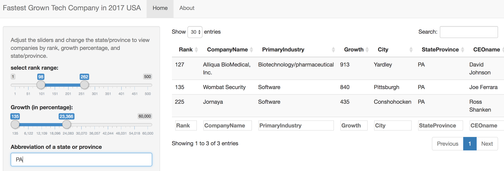

Data Products Course Project: Reproducible Presentation Pitch For Shiny App
========================================================
author: Rui Hu
date: 12/01/2017
autosize: true
width: 1080
height:1000
transition: rotate

Course Project
========================================================

This presentation is part of the final project for the Coursera Course "Developing Data Products."
The course final project includes two parts:
- **Part one**: To develop a Shiny app to display the data based on the users' input. 
- **Part two**: A reproducible pitch presentation including five slides published in either Slidify or Rstudio presenter, including embedded R codes. 

## Links
- Shiny app: [link](https://maggiehu.shinyapps.io/fastest_growing_tech_companies_in_north_america_2017/)
- server.R and ui.R files: 

Fastest Growing Tech Companies 2017 in North America - The Data
========================================================
For this assignment, the data was retrieved from [data.world](https://data.world/jgrosch/deloitte-technology-fast-500-2017-north-america).
The original data was in the format of .xlsx. It was then converted to csv file and read into R.   


```r
data<-read.csv("tech_ranking.csv",header=T)
summary(data)
```

```
      RANK                             COMPANY.NAME
 Min.   :  1.0   2nd Watch                   :  1  
 1st Qu.:126.8   3xLOGIC                     :  1  
 Median :251.5   500px                       :  1  
 Mean   :251.3   Acacia Communications, Inc. :  1  
 3rd Qu.:376.2   Acadia Pharmaceuticals, Inc.:  1  
 Max.   :500.0   Accurate Background         :  1  
                 (Other)                     :494  
                            PRIMARY.INDUSTRY     GROWTH   
 Software                           :292     152%   :  5  
 Biotechnology/pharmaceutical       : 82     154%   :  5  
 Digital content/media/entertainment: 55     196%   :  5  
 Medical devices                    : 21     169%   :  4  
 Communications/networking          : 20     195%   :  4  
 Electronic devices/hardware        : 17     209%   :  4  
 (Other)                            : 13     (Other):473  
            CITY         PROV.                CEO.NAME      X          
 New York     : 55   CA     :148   Jack Dorsey    :  2   Mode:logical  
 San Francisco: 25   NY     : 61   Aaron Levie    :  1   NA's:500      
 Toronto      : 20   ON     : 41   Aaron Skonnard :  1                 
 Seattle      : 17   MA     : 32   Adam Belsher   :  1                 
 San Diego    : 15   WA     : 25   Adam Caromicoli:  1                 
 Atlanta      : 14   GA     : 19   Adam Elsesser  :  1                 
 (Other)      :354   (Other):174   (Other)        :493                 
```

Fastest Growing Tech Companies 2017 in North America - The Application
========================================================
This web app has two tabs on the top: **Home** and **About**.  

Under **Home** is the main app, including the interactive data input panel on the left side, and the data display on the right side.  

Under **About** is a brief introduction to this app. 

Below is a screenshot of the app:  


Fastest Growing Tech Companies 2017 in North America - How to Use
========================================================
On the left side of the app, you will be able to adjust your selections by: Rank, Growth (by Percentage), and by State/Province. To avoid empty display, the default state/province has been set to "GA." To change the selection of state/province, you will need to delete the default and type in an abbreviation of a state or province.  

On the right side, you will see the corresponding results based on your selection of ranges of ranks, growth, and state/province. You can also use the arrows next to each column name to sort the results. 

You can also search the results using the "Search" box.

